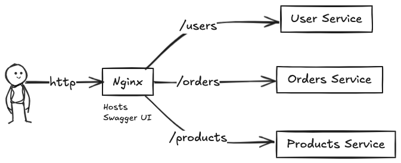
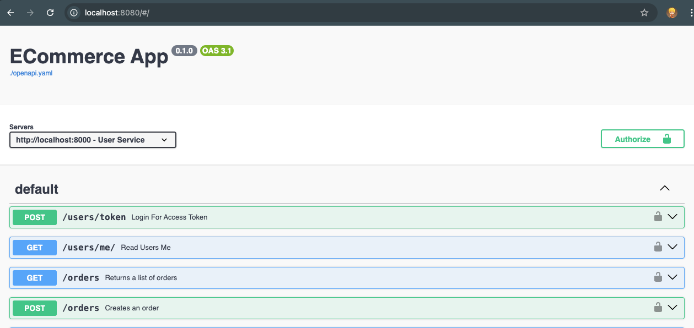

# ECommerce app

This is toy ecommerce app with the following minimalist features. The agenda is 
not to build a feature application but to showcase a simple application of
microservices architecture.

## Functional requirements

1. The app has 3 microservices - 
    a. _User_: To manage user data & enable authentication mechanisms.
    b. _Products_: To mangae product related data. It also manages the inventory data.
    c. _Orders_: To manage the orders created in the ecommerce system.
1. For simplicity there is no payments, order fulfillment, order tracking etc logic.
1. Two types of user: Sellers & Buyers. 
1. Sellers can create new products. They can update & disable their products. 
    They can list all their products.
1. Buyers can create new orders. They can get the details of a single orders or 
    can list all their orders.
1. On successful order creation, the inventory of the product should be decremented.
    Race conditions should be handled ie if two orders are trying to book the last
    item of a proudct simultaneously only one should succeed.
1. Use a database to persist the data.
1. Expose RESTful apis for the users to interact with the system.
1. Implement user authentication and autherization for accessing protected endpoints.

## Implementations details

1. The web services are implemented in python using FastAPI framework.

1. There is an nginx service that acts like a reverse proxy and provides a 
    single entrypoint point for the users to entract with the entire ecosystem.

1. The consolidated http apis for user login, order management etc documented 
    using Swagger UI. This means that the http apis follows the OpenAPI standard
    for documentation. Secondly, you can interact with the apis using the 
    Swagger UI.





1. Each service has its own swagger UI. It is to showcase Contract Driven 
    Development across teams.

1. The orders service is implemented using [hexagonal architecture](https://en.wikipedia.org/wiki/Hexagonal_architecture_(software)). 
    As a side note, this [Netflix blog](https://netflixtechblog.com/ready-for-changes-with-hexagonal-architecture-b315ec967749)
    explains the advantages of hexagonal architecture. 
    This is to showcase the implentation of hexagonal architecture and the complexities
    it adds.

1. Dependencies, like DB client, are injected in the business logic to enhance 
    code readability and maintainability.

1. Authentication is implemented using JWT tokens. User service exposes an api 
    to accept `username` and `password` and generates a JWT which stores the user 
    details. The JWT token needs to be included in further requests in the
    `Authentication` header.

1. Request validation is done using the awesome `pydantic` python library.
    Pydantic V2 is implemented using Rust and thus is highly performant.

1. Relational datamodel is used in all the services. Sqlalchemy V2 is used as 
    the ORM. This means that you can use the app with any RDBMS like Postgres, 
    MySQL etc.

1. Configuration is separated from business logic and is stored in a separate
   object which is populated using env vars. The config has default values
   which means that you can start the app on your local with minimal
   configuration.

1. All services are containerised(ie Dockerfile is used) to easy deployment in 
    any environment(prod and non-prod).

1. The project root contains a `docker-compose.yaml` file. The entire setup can
   be run locally using `docker compose`.

1. The current setup of containerised applications can be used with any
   container orchestration tool like kubernetes to deploy and scale these
   applications in production.

## Working Locally

This section describes how to start the various services on your local machine.

Project structure:

```
.
├── README.md
├── docker-compose.yaml
├── img         # images for documetation
├── nginx       # ngin configuration
├── orders      # orders service
├── products    # products service
├── swagger     # OpenAPI spec
└── users       # users service
```

### Creating Database 

Each service has it's own database. The following are the default values for
the DB, you can change them if you want.

```sql 
-- For simplicity, we create a single database
CREATE DATABASE ecommdb;
GRANT ALL PRIVILEGES ON DATABASE ecommdb TO postgres; -- postgres is the default user
-- the password mentioned in the config files is 'admin'
```

You can provide the DB creds in the `.env` file in the root of each service. If
you start the service without docker edit `.env` file and load it in the shell
session. For working with docker, the configurations are mentioned in
`.docker.env` file.

### Create Tables and Seed Data

Users Srv

```sh
cd users

# install dependencies
python -m venv .venv
source .venv/bin/activate
pip install -r requirements.txt

# run migration script
PYTHONPAHT=$PWD/src python src/migrations.py
```

This will create a user with following details. You can use this user or 
register a new user.

```
username: user-1
password: password
user_role: BUYER
```

Products Srv

```sh
cd products

# install dependencies
python -m venv .venv
source .venv/bin/activate
pip install -r requirements.txt

# run migration script
PYTHONPAHT=$PWD/src python src/migrations.py
```

This will create a products with id `1` and `2`. You can use these product ids 
while creating orders.

Orders Srv

```sh
cd orders

# install dependencies
python -m venv .venv
source .venv/bin/activate
pip install -r requirements.txt

# run migration script
PYTHONPAHT=$PWD/src python src/migrations.py
```


### Starting the Services

```sh
# cd into project root

docker compose up
```

This will start four services: `swagger-ui, orders, users, products`

Swagger UI Docs can be accessed at the following endpoints -

```
Consolidated docs:  http://localhost:8080
users srv:          http://localhost:8001
products srv:       http://localhost:8002
orders srv:         http://localhost:8003
```

You can user `http://localhost:8080` to work with the application.

Note that orders service is dependent on products service to book products 
while creating an order.
